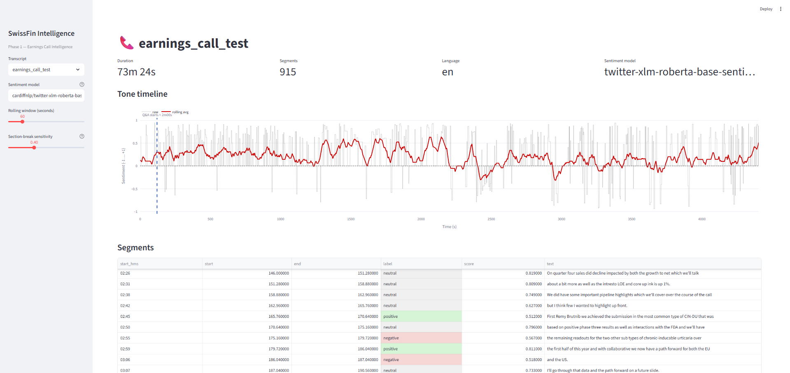

# SwissFin Intelligence

> **Local, privacy-first AI for Swiss earnings calls and financial documents.**
> No cloud LLMs, no data leaving your machine — built for banks, asset managers, and quant teams that can't ship MNPI to OpenAI.

[](https://github.com/aaronashraf/swissfin-intelligence)
[](https://www.python.org/)
[](LICENSE)
[](docs/ROADMAP.md)



---

## Why this exists

Swiss financial institutions sit on a uniquely sensitive corpus — earnings calls, internal research, board memos, M&A diligence — that is exactly the kind of text where modern LLMs add the most analytical leverage. They also operate under FINMA expectations, banking secrecy law, and internal data-classification rules that make routing this content through OpenAI, Anthropic, or any US-hosted endpoint a non-starter.

**SwissFin Intelligence** is the answer I'd want as a Swiss quant analyst: a fully local pipeline that ingests audio and PDFs, transcribes and embeds them with open-weights models, and lets you ask analytical questions over the result — all on your own hardware, with reproducible artefacts on disk.

Phase 1 ships the earnings-call subsystem end-to-end. Later phases extend the same architecture to annual reports, German-finance-tuned sentiment, and a production FastAPI deployment.

## Current state

> **Phase 1 in active development.** The core pipeline (download → transcribe → score → visualize) is in place. German-finance-tuned models, RAG over PDFs, and the FastAPI service are explicitly out of scope for this milestone.

| Phase | Scope                                                          | Status         |
|-------|----------------------------------------------------------------|----------------|
| 1     | Earnings Call Intelligence (transcription + sentiment)          | 🚧 In progress |
| 2     | PDF Annual Report RAG                                           | ⏳ Planned     |
| 3     | German Finance Sentiment Fine-Tune + custom dataset on HF       | ⏳ Planned     |
| 4     | Production deployment (FastAPI + Docker)                        | ⏳ Planned     |

See [`docs/ROADMAP.md`](docs/ROADMAP.md) for the full breakdown — scope, deliverables, success metrics, and rough timing per phase.

## Quick start

Tested on Python 3.11+ (Linux, macOS, Windows via WSL or Git-Bash). FFmpeg must be on your `PATH` for audio decoding.

```bash
# 1. Clone
git clone https://github.com/aaronashraf/swissfin-intelligence.git
cd swissfin-intelligence

# 2. Install (creates .venv/, installs deps + the package in editable mode)
make setup
# Equivalent on Windows PowerShell:
#   python -m venv .venv
#   .venv\Scripts\Activate.ps1
#   pip install -r requirements-dev.txt
#   pip install -e .

# 3. Configure (optional — defaults are fine)
cp .env.example .env

# 4. Run the full pipeline on an example call
make pipeline URL="https://www.youtube.com/watch?v=XXXX" NAME="ubs_q3_2025"

# 5. Explore results in the Streamlit UI
make run-app
# → opens http://localhost:8501
```

The first transcription will pull Whisper weights (~480 MB for `small`) and the multilingual sentiment model into the standard HuggingFace cache (`~/.cache/huggingface/`). Subsequent runs are offline.

### CLI alternative (no Make)

```bash
# Download only
python scripts/download_call.py --url "<URL>" --name ubs_q3_2025

# Transcribe a previously-downloaded file
python scripts/transcribe.py --name ubs_q3_2025 --model small

# Score sentiment on the transcript
python scripts/analyze_sentiment.py --name ubs_q3_2025

# Or do all three in one shot
python scripts/run_pipeline.py --url "<URL>" --name ubs_q3_2025
```

## Architecture

```
                            ┌────────────────────────┐
        URL  ─────────────► │  audio.downloader      │  yt-dlp + FFmpeg
                            │  (m4a, mono, 192 kbps) │
                            └──────────┬─────────────┘
                                       ▼
                            ┌────────────────────────┐
                            │  audio.chunker         │  silence-aware
                            │  (~10 min chunks)      │  pydub split
                            └──────────┬─────────────┘
                                       ▼
                            ┌────────────────────────┐
                            │  transcription.        │  openai-whisper,
                            │  whisper_runner        │  CPU or CUDA
                            └──────────┬─────────────┘
                                       ▼
                            ┌────────────────────────┐
                            │  sentiment.analyzer    │  HF transformers
                            │  (multilingual XLM-R)  │  batched inference
                            └──────────┬─────────────┘
                                       ▼
                            ┌────────────────────────┐
                            │  analysis.tone_timeline│  rolling avg +
                            │  + section-break heur. │  Q&A detection
                            └──────────┬─────────────┘
                                       ▼
                              data/outputs/<name>.sentiment.json
                                       │
                                       ▼
                              app/streamlit_app.py  (visual layer)
```

## Tech stack

- **Python** 3.11
- **PyTorch** 2.5 — CPU-first install path; CUDA picked up automatically when present
- **openai-whisper** 20240930 — local speech-to-text, all sizes from `tiny` to `large-v3`
- **transformers** 4.46 (HuggingFace) — sentiment via [`cardiffnlp/twitter-xlm-roberta-base-sentiment`](https://huggingface.co/cardiffnlp/twitter-xlm-roberta-base-sentiment) (swapped for a German-finance fine-tune in Phase 3)
- **librosa** 0.10 + **pydub** 0.25 — audio I/O and silence-aware chunking
- **pandas** 2.2 — tabular post-processing
- **streamlit** 1.40 + **plotly** 5.24 — demo UI
- **pydantic-settings** 2.6 — typed `.env`-driven configuration
- **yt-dlp** 2025.10 — robust audio acquisition from YouTube and IR sites
- **ruff** + **black** + **pytest** — lint, format, test (line length 100)

Full pinned set: [`requirements.txt`](requirements.txt) and [`requirements-dev.txt`](requirements-dev.txt).

## Project structure

<details>
<summary>Click to expand</summary>

```
swissfin-intelligence/
├── README.md
├── LICENSE
├── pyproject.toml
├── requirements.txt
├── requirements-dev.txt
├── .env.example
├── .gitignore
├── Makefile
├── data/
│   ├── raw/              # downloaded audio (gitignored)
│   ├── transcripts/      # whisper outputs (gitignored)
│   └── outputs/          # sentiment JSONs (gitignored)
├── src/swissfin/
│   ├── config.py         # pydantic-settings + logging
│   ├── audio/
│   │   ├── downloader.py
│   │   └── chunker.py
│   ├── transcription/
│   │   └── whisper_runner.py
│   ├── sentiment/
│   │   └── analyzer.py
│   ├── analysis/
│   │   └── tone_timeline.py
│   └── utils/
│       └── io.py
├── scripts/
│   ├── download_call.py
│   ├── transcribe.py
│   ├── analyze_sentiment.py
│   └── run_pipeline.py
├── app/
│   └── streamlit_app.py
├── tests/
│   ├── test_chunker.py
│   ├── test_analyzer.py
│   └── fixtures/sample_transcript.txt
└── docs/
    └── ROADMAP.md
```

</details>

## Configuration

All runtime knobs live in `src/swissfin/config.py` and are overridable via environment variables (or `.env`):

| Variable                          | Default                                                | Purpose                              |
|-----------------------------------|--------------------------------------------------------|--------------------------------------|
| `SWISSFIN_WHISPER_MODEL`          | `small`                                                | Whisper size: `tiny` … `large-v3`     |
| `SWISSFIN_WHISPER_LANGUAGE`       | _(auto)_                                               | Force `de` / `en` / `fr` / `it`       |
| `SWISSFIN_SENTIMENT_MODEL`        | `cardiffnlp/twitter-xlm-roberta-base-sentiment`        | Any HF text-classification model      |
| `SWISSFIN_SENTIMENT_BATCH_SIZE`   | `16`                                                   | Inference batch size                  |
| `SWISSFIN_CHUNK_SECONDS`          | `600`                                                  | Audio chunk target length             |
| `SWISSFIN_DATA_DIR`               | `./data`                                               | Override artefact root                |
| `SWISSFIN_LOG_LEVEL`              | `INFO`                                                 | `DEBUG` / `INFO` / `WARNING` / `ERROR` |

> **HuggingFace cache:** model weights are downloaded once into `~/.cache/huggingface/` (override with `HF_HOME`). After the first run the pipeline works fully offline.

## Development workflow

```bash
make lint      # ruff
make format    # ruff --fix + black
make test      # pytest with coverage
make check     # lint + test (CI gate)
```

The test suite mocks all heavy ML calls and runs in well under a second.

## Roadmap

The full multi-phase plan — including success metrics, deliverables, and timing — lives in [`docs/ROADMAP.md`](docs/ROADMAP.md). Highlights:

- **Phase 2:** ingest annual reports (SIX-listed) into a local vector DB; cross-link transcript claims with PDF source paragraphs.
- **Phase 3:** publish a German-finance sentiment dataset on HuggingFace and a fine-tuned XLM-R model trained on Swiss IR transcripts.
- **Phase 4:** ship a FastAPI service + Docker image so internal teams can call the pipeline as an API behind their VPN.

## About the author

Built by **Aaron Ashraf** — a 21-year-old Swiss developer (ICT-Fachmann EFZ) heading into a Data Science degree at ZHAW, with a long-term focus on AI applied to financial markets. SwissFin Intelligence is the technical spine of a multi-year portfolio: every phase produces something I'd be proud to demo in a job interview at a Swiss bank, asset manager, or quant fund. I write about the journey on my [Substack](https://aaronashraf.substack.com).

## License

MIT — see [`LICENSE`](LICENSE). Use it freely, fork it, build on top. Attribution is appreciated, not required.
